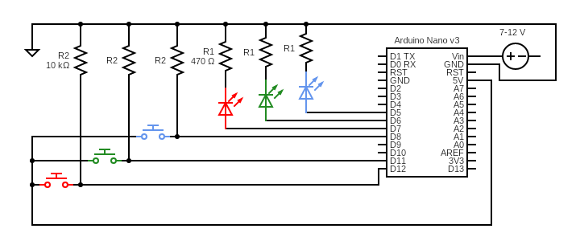

# SpeedTester

## Description
If you were looking for meth purity testing, I'm sorry to disappoint you. In other cases follow through my first touch into the embedded world!

In this project I tried to implement hardware and software of arcade style speed testing game. The game works by turning on leds one at the time at "random" order. 
Before the led turns off, player has to press corresponding button. If player succeeds to press the button before time runs out, led turns off for a little while and a new led turns on.
If player presses wrong button, or the time runs out, game will end. All leds light up signaling that. Time that player has to press correct button gets smaller at each successful round.
In the beginning all three leds will flash three times to indicate game is about to begin. To achieve this functionality I used interrupts.

I started this project in order to learn some basics about embedded systems. Before this project I had no practical experience with any microcontrollers or programming them. 
I had some programming and physics knowledge to help me get started though. During this project I learned a lot about arduino microcontrollers and electronics. 
Aside from basic arduino functionality I learned especially about interrupts. Because all troubles caused by cheap arduino clone, I also learned little about bootloaders, and drivers.

As this was my first embedded project, in this document I try to list solutions to many things that made me as beginner bang my head against the wall.

NOTE! This documentation is being made almost a year after completion of this project! Documentation in code file is in finnish. Sorry!

## Installation
1. Clone the project
   ```bash
   git clone https://github.com/cL4ssiK/SpeedTester.git
   ```

## Project setup
This section provides list of equipment used in project.
1. Arduino Nano 3 clone including
   - ATMega168 microcontroller
   - CH340C usb bus converter chip
2. Breadboard
3. 3x 470Ω Resistors for leds
4. 3x 10kΩ Pull-down resistors for buttons
5. 3x leds (red, green, blue)
6. 3x push buttons
7. male to male wires for connections

NOTE! 
- You should be able to use any arduino microcontroller with this project. All clones should work as well, as long as there is (correct) bootloader burned.
  I used cheapest clone money could buy from ebay so I got one with no bootloader and cheapest microcontroller. If you are using cheap clones, make sure you have correct bootloader and
  correct drivers for usb bus converter chip.
- Led resistors could be bigger, since arduino nano has 5V output. With 470Ω resistors my eyes started hurting after few test runs.
- You can of course make this project without breadboard, but I highly recommend using one.

### Scematics


Wiring diagram for project. 

For simplicity, I have coloured the leds and buttons that interact with each other using same color. That color matches to global variable names in code as well.

NOTE! 
- Differing from scematic presented, you can use usb port to power on the microcontroller.
- Many arduino boards (if not all) have build in pull-up resistors. This variation is presented in variations section.

## Usage
1. Build the circuit presented in scematics.
2. Open speedtester.ino in arduino IDE.
3. Connect arduino to the computer via USB cable
4. Press the upload button in the IDE.

After successful upload all leds blink three times to indicate game is about to begin.
If you want to play again, either unplug and replug the power source, or press reset button logated in the arduino board.

## Software
If you think for a while how single thread program is run, it raises an issue. How is it possible to time listening correctly for each button while running the program? 
This is where interrupts come in. At least for arduino Uno, and to my knowledge also for Nano there are three types of interrupts. These are hardware interrupts, pin change interrupts and timer interrupts. 

In this project I decided to use pin change interrupts, PCI for short. I chose this because I needed three pins to be listened for interrupts and with nano hardware interrupt has only two pins. Also, I could use same functionality with all three buttons. PCI suits this purpose perfectly. Pins are devided into ports, that call same interrupt. To activate PCI:s we need to enable them by manipulating following registers.

Enabling the port B (pins D8-D13) ([Line 32](https://github.com/cL4ssiK/SpeedTester/blob/69b926862b1b185bcbb9c5f54a77d491051d69cc/speedtester.ino#L32C3-L32C22)):
  ```
  PCICR |= B00000001;
  ```

Enabling pins D12, D11 and D8 for interrupts ([Line 34](https://github.com/cL4ssiK/SpeedTester/blob/69b926862b1b185bcbb9c5f54a77d491051d69cc/speedtester.ino#L34)):
  ```
  PCMSK0 |= B00011001;
  ```

Then we need to define the interrupt service routine (ISR). Names of these methods are already defined, so we need to choose right one, and implement functionality for it.
For port B we use ISR(PCINT0_vect) ([Lines 17-27](https://github.com/cL4ssiK/SpeedTester/blob/69b926862b1b185bcbb9c5f54a77d491051d69cc/speedtester.ino#L17)):
  ```
  ISR (PCINT0_vect) {
    if ( digitalRead(buttonRed)  == LOW ) {
      buttonPressedPin = buttonRed;
    }
    else if ( digitalRead(buttonGreen)  == LOW ) {
      buttonPressedPin = buttonGreen;
    }
    else if ( digitalRead(buttonBlue)  == LOW ) {
      buttonPressedPin = buttonBlue;
    }
  }
  ```
This interrupt method finds out which button was pressed, and stores the value into buttonPressedPin variable.

In delayLoop we notice if buttonPressedPin changes value ([Lines 134-136](https://github.com/cL4ssiK/SpeedTester/blob/69b926862b1b185bcbb9c5f54a77d491051d69cc/speedtester.ino#L134)):
  ```
  if ( buttonPressedPin != -1 ) { 
      break; 
  }
  ```

And then it is evaluated, if pressed button was corresponding to led that is turned on ([Lines 106-111](https://github.com/cL4ssiK/SpeedTester/blob/69b926862b1b185bcbb9c5f54a77d491051d69cc/speedtester.ino#L106C1-L111C2)):
  ```
  bool wasPressCorrect(int buttonToBePressedPin) {
    if ( buttonPressedPin == buttonToBePressedPin ) {
      return true;
    }
    return false;
  }
  ```

With interrupts it is crucial to make variables that can change inside ISR volatile ([Line 13](https://github.com/cL4ssiK/SpeedTester/blob/69b926862b1b185bcbb9c5f54a77d491051d69cc/speedtester.ino#L13)):
  ```
  volatile int buttonPressedPin = -1;
  ```
This keyword makes sure, that every read and write to that variable is actually performed and not optimized out by compiler.[2]

Rest of the code does not contain any interesting features, so we do not analyze it here.

More information about Interrupts.[1]

## Credits

This project could not been possible without content of dronebotworkshop. I learned about interrupts from his web page and Youtube videos.

[1] [dronebotworkshop.com/interrupts](https://dronebotworkshop.com/interrupts/)

[2] My interpretation of ChatGPT:s answer with prompt "what does volatile mean in C/C++?"
